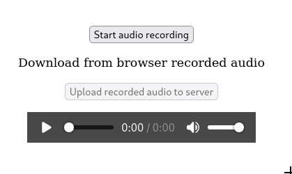
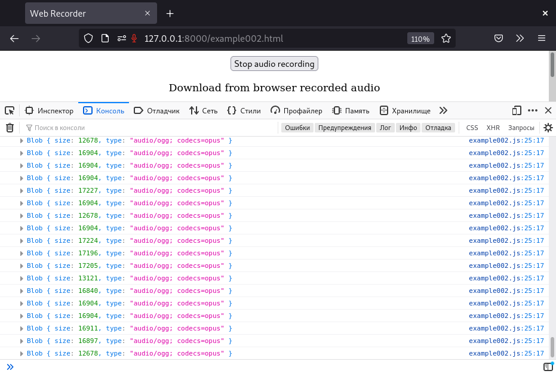
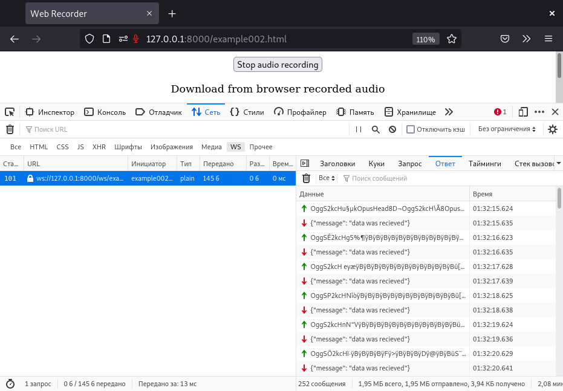

# Django Audio record

Base project. Save recorded audio from browser to server by Django. It contains example of online auto upload audio to server by websocket.


## Examples

```shell
python3.8 manage.py migrate
python3.8 manage.py runserver
```

* example001.png - record and upload buttons



* example002.png - record and auto upload by websocket





## Notes

* https://developer.mozilla.org/en-US/docs/Web/API/MediaStream_Recording_API/Recording_a_media_element
* https://mozdevs.github.io/MediaRecorder-examples/
* https://simpl.info/mediarecorder/
* https://www.smashingmagazine.com/2022/03/audio-visualization-javascript-gsap-part1/